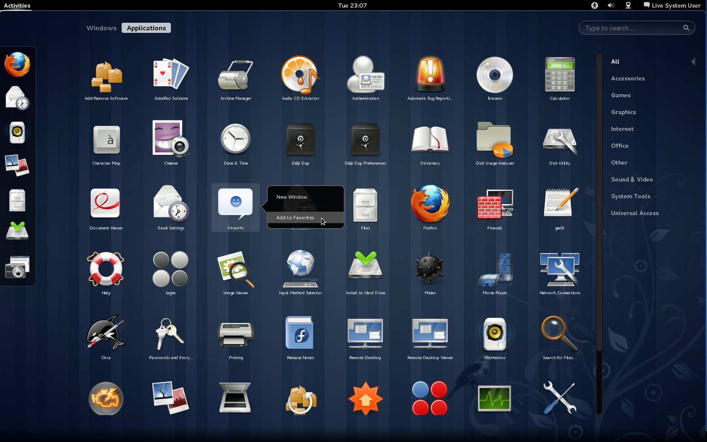

% Source-based distributions from E to O
% Marc-Antoine Perennou - Clever Cloud
% 15 Septembre 2014

-------------------------------------------

## What is a linux-based distribution?

- a common kernel: linux
- a set of basic tools and software
- a way to install new software
- a graphical identity (sometimes)

-------------------------------------------

## Example: ubuntu

-------------------------------------------

## Example: fedora

-------------------------------------------

## What is a source-based linux distribution?

- a standard linux distribution
- "binary" packages
- source-based packages

. . .

- ease of configuration
- rolling release

-------------------------------------------

## So, it's Gentoo, right?

Yes.

. . .

No.

. . .

- Sorcerer
- Lunar-Linux
- Source Mage

. . .

- Exherbo

-------------------------------------------

## But, don't you have a job? Compiling is time consuming!

. . .

- less time than a cigaret break

. . .

- less than 10min/day average
- everything in background
- night tasks

. . .

- need your computer power? think Clever Cloud

-------------------------------------------

## It still seems hard and boring, nothing is automatic :(

- entry cost
- ease of use
- powerful

. . .

- automation
- binary packages

-------------------------------------------

## Thanks

<http://clever-cloud.com>

<http://www.imagination-land.org>

[Marc-Antoine@Perennou.com](mailto:Marc-Antoine@Perennou.com)

[\@Keruspe](https://twitter.com/Keruspe)

[Keruspe on github](https://github.com/Keruspe)

