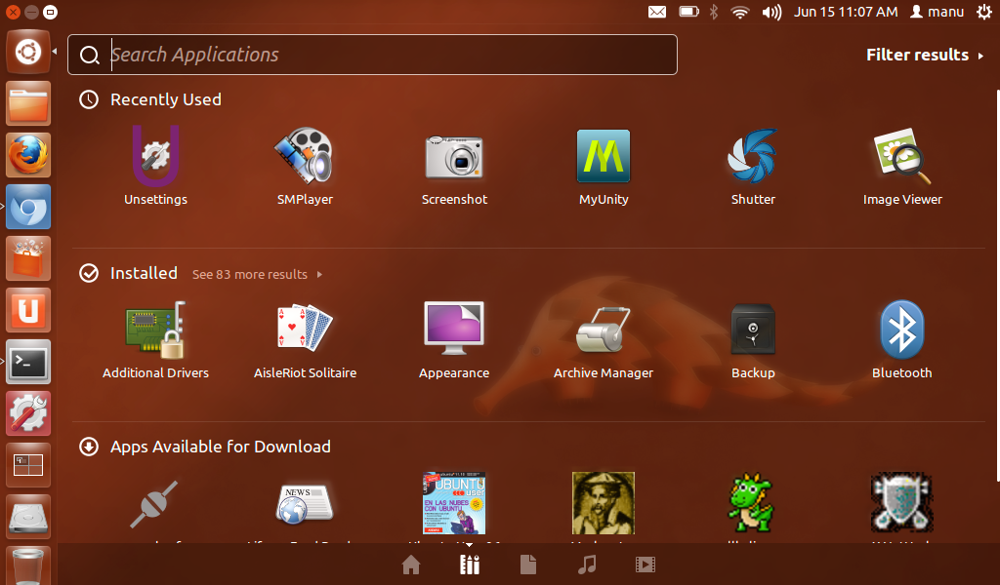

% Source-based distributions from E to O
% Marc-Antoine Perennou - Clever Cloud
% 15 Septembre 2014

-------------------------------------------

## What is a linux-based distribution?

- a common kernel: linux
- a set of basic tools and software
- a way to install new software
- a graphical indentity (sometimes)

-------------------------------------------

## Example: ubuntu

-------------------------------------------

## Example: fedora

-------------------------------------------

## What is a source-based linux distribution?

-------------------------------------------

## So, it's Gentoo, right?

-------------------------------------------

## But, don't you have a job? Compiling is time consuming!

-------------------------------------------

## It still seems hard and boring, nothing is automatic :(

-------------------------------------------

## Thanks

